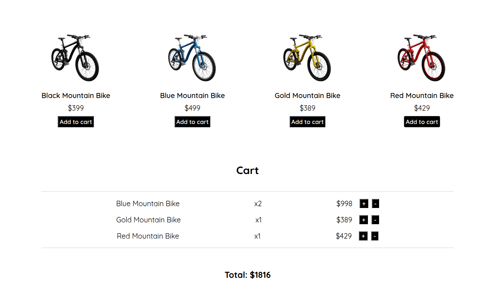

# Mini Cart Project

A simple, responsive shopping cart built with **vanilla JavaScript** — no frameworks.

Data is persisted in `localStorage`, and reactivity is handled using native browser APIs and HTML templates.

[🚀 Live Demo](https://mini-cart-project-nj3x.vercel.app/)

---

## 🔧 Features

- Add/remove products from cart
- Quantities update dynamically
- Cart data persists across page reloads
- Fully functional with no external libraries
- HTML5, CSS3, and ES6+ syntax

---
